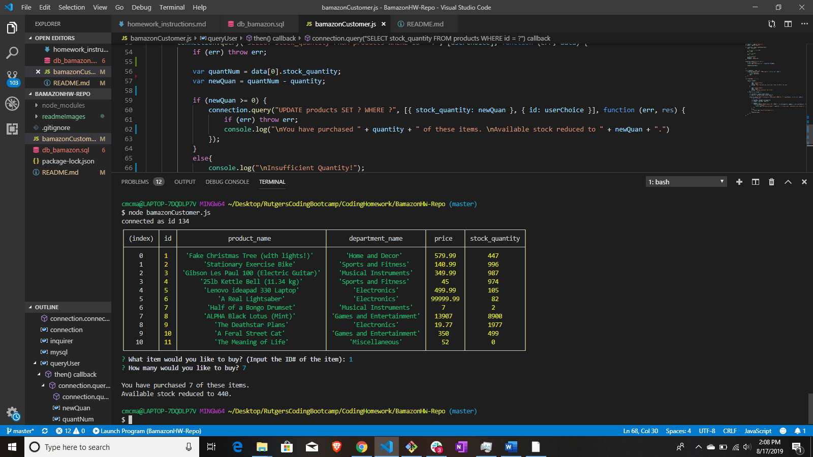

# Bamazon Project

* This project allows a user to make "purchases" from a "Bamazon" application.

* Please use the **db_bamazon.sql** file to create your copy of the database in MySQL.

### How The App Works 

* This application is accessed through a Node CLI (Command Line Interface).

* Open the **bamazonCustomer.js** file in the VSCode terminal.

* Run the file using the CLI command "**node bamazonCustomer.js**". The table of items, prices, and quantities will display, and you will be asked which item you'd like to buy:

    * 

* Once you select the item ID of the Product you'd like, you will asked *how many* of that item you with to buy:

    * 

* Your user-input is then taken by the code and used the update the database. It takes the quantity you'd like to purchase, subtracts it from the stock of the item in the database, then updates the database with that new stock quantity:

    * 

* If you then run the code again (**node bamazonCustomer.js**) to make another "purchase", you will see that the table that displays show the new stock for the item you purchased.

    * 